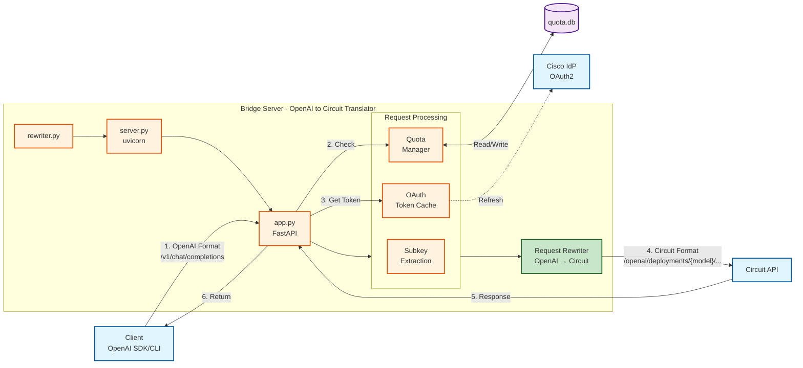

## Architecture

### What this bridge does

- **Rewrites OpenAI-format requests into Circuit's deployment-based API format**
  - Accepts OpenAI-compatible requests at `/v1/chat/completions`
  - Transforms URL structure: `/v1/chat/completions` → `/openai/deployments/{model}/chat/completions?api-version=...`
  - Translates authentication from OpenAI API keys to Circuit OAuth2 tokens
  - Injects Circuit-specific metadata (appkey)
- Exposes a minimal surface:
  - POST `/v1/chat/completions` (OpenAI format in, Circuit format out)
  - GET `/health`
- Obtains and caches OAuth2 access tokens for Circuit authentication
- Runs HTTP, HTTPS (self-signed), or dual-mode servers

## Architecture Overview

### Request Flow

1. **Client Request**: Client sends OpenAI-format request to `/v1/chat/completions` (HTTP or HTTPS)
   - Includes `model` parameter and OpenAI-style payload
   - Provides subkey via `X-Bridge-Subkey` header or `Authorization: Bearer <subkey>`

2. **Subkey & Quota Check**: 
   - `extract_subkey()` parses headers to identify caller
   - `QuotaManager` checks if request is allowed based on configured limits
   - Returns `429` if quota exceeded; otherwise continues

3. **OAuth Token Management**:
   - `get_access_token()` checks in-memory `TokenCache`
   - If expired (< 60s remaining), fetches new token from Cisco IdP
   - Uses client credentials flow with `CIRCUIT_CLIENT_ID` and `CIRCUIT_CLIENT_SECRET`

4. **Request Transformation (OpenAI → Circuit)**:
   - **Incoming**: OpenAI-format request to `/v1/chat/completions` with model parameter
   - **Rewriting**:
     - Injects `CIRCUIT_APPKEY` into `user` field
     - Rewrites URL from OpenAI format to Circuit deployment format:
       - From: `/v1/chat/completions`
       - To: `https://chat-ai.cisco.com/openai/deployments/{model}/chat/completions?api-version=2025-04-01-preview`
     - Replaces authentication: Sets `api-key` header with OAuth2 access token
   - **Outgoing**: Circuit-compatible request ready for forwarding

5. **Forward to Circuit**: Bridge proxies transformed request to Circuit API

6. **Response Handling**:
   - Receives response from Circuit (may include `usage.total_tokens`)
   - Records token usage in `quota.db` for subkey tracking
   - Returns raw response to client

7. **Quota Tracking**: Post-response usage data stored in SQLite for enforcement

## Components

### Core Package (`oai_to_circuit/`)

- `server.py`: Server entrypoint with CLI argument parsing and uvicorn startup (HTTP/HTTPS/dual-mode).
- `app.py`: FastAPI application factory and endpoint handlers.
  - Endpoints: `/health`, `/v1/chat/completions`
  - Request rewrite/proxy to Circuit with quota enforcement
  - Subkey extraction from headers
- `oauth.py`: OAuth2 client credentials flow with in-memory token caching.
- `quota.py`: QuotaManager for per-subkey, per-model usage tracking (SQLite) and quota loading from env/JSON.
- `config.py`: Configuration dataclass and environment variable loading.
- `logging_config.py`: Unified logging configuration with colorized output and logger renaming filters.

### Entry Points

- `rewriter.py`: Thin wrapper that imports and starts the server from `oai_to_circuit.server`.

### Development Tools

- `generate_cert.py`: Self-signed certificate generator for local HTTPS development.
- `examples.py`, `python_openai_demo.py`: Usage examples demonstrating curl and OpenAI SDK integration.
- `debug_invalid_http.py`: Diagnostics script for troubleshooting common connection issues.

### Tests (`tests/`)

- `test_quota.py`: QuotaManager request/token limit enforcement.
- `test_quota_loading.py`: Quota configuration loading from env/file.
- `test_subkey_extraction.py`: Header parsing for caller subkey identification.
- `test_requests.py`: End-to-end FastAPI endpoint behavior (health, chat completions, error cases).
- `test_config.py`: Environment variable and default configuration loading.
- `test_oauth.py`: Token caching, expiry, and missing credential handling.
- `test_logging_config.py`: Logger renaming filter behavior.
- `test_https.py`: Server SSL configuration validation.

Run tests with: `pytest`

## Endpoint behavior

### GET `/health`
- Returns service status and flags indicating whether credentials/appkey are configured.

### POST `/v1/chat/completions`
- Input: OpenAI-style payload (`model`, `messages`, plus optional params like `temperature`, `stream`, etc.).
- Required: `model` must be provided; otherwise 400 is returned.
- The bridge:
  - Parses JSON, validates `model`, logs headers/body for debugging (at debug level).
  - Ensures a valid OAuth2 token via `get_access_token()`. Tokens are cached in memory until ~60s before expiry.
  - Extracts a caller subkey from `X-Bridge-Subkey` or `Authorization: Bearer <subkey>` and enforces request quotas if configured.
  - Injects an `appkey` into the `user` field if not present (or merges it if `user` is valid JSON). The `CIRCUIT_APPKEY` is read from environment variables.
  - Forwards the transformed request to Circuit at:
    - `https://chat-ai.cisco.com/openai/deployments/{model}/chat/completions?api-version=2025-04-01-preview`
  - Sets headers for the upstream request:
    - `Content-Type: application/json`
    - `Accept: application/json`
    - `api-key: <OAuth2 access token>`
- Output: The raw upstream body is returned with the upstream `Content-Type` when available (no additional transformation). Post-response, token usage (if present) is recorded for quotas.
  - Note: Responses are currently returned as a single body; the bridge does not re-stream chunked responses.

## OAuth2 and token caching

- Flow: Client Credentials against Cisco IdP (`TOKEN_URL = https://id.cisco.com/oauth2/default/v1/token`).
- The bridge forms a Basic auth header from `CIRCUIT_CLIENT_ID:CIRCUIT_CLIENT_SECRET`, requests `grant_type=client_credentials`, and caches `access_token` and `expires_in`.
- Cache policy: If current time is within 60 seconds of expiry, a new token is fetched; otherwise the cached token is reused.
- Storage: In-memory (per-process). In dual-mode, each process maintains its own cache (potential duplicate fetches are acceptable).

## Configuration and secrets

- Required environment variables:
  - `CIRCUIT_CLIENT_ID`
  - `CIRCUIT_CLIENT_SECRET`
  - `CIRCUIT_APPKEY`
- Quotas/subkeys (optional but recommended for shared API key scenarios):
  - `REQUIRE_SUBKEY` (default: true) – require a caller subkey per request
  - `QUOTA_DB_PATH` (default: `quota.db`) – SQLite file for usage tracking
  - `QUOTAS_JSON` – inline JSON mapping subkey→model→limits
  - `QUOTAS_JSON_PATH` (default: `quotas.json`) – file to load quotas if `QUOTAS_JSON` unset
  - Subkey is read from `X-Bridge-Subkey` or `Authorization: Bearer <subkey>` (used locally for quotas; not forwarded upstream)
- The bridge ignores the incoming `Authorization` value for upstream authentication; it is used only to identify the caller subkey. Upstream access control relies on the configured Circuit credentials and appkey.
- No secrets are hardcoded in the repository. Set them via environment variables or a secure secrets mechanism in your runtime environment.

Security note (No Hardcoded Credentials policy): This project reads sensitive values from environment variables and never commits credentials to source. Ensure your deployment uses a proper secret manager (e.g., environment injection from your orchestrator) and never embeds secrets in code, images, or logs.

## HTTPS and certificates

- Modes:
  - HTTP-only (default): `python rewriter.py`
  - HTTPS-only: `python rewriter.py --ssl-only`
  - Dual HTTP/HTTPS: `python rewriter.py --ssl`
- Self-signed certs for development can be generated with `generate_cert.py` (writes `cert.pem` and `key.pem`).
- In HTTPS modes, `uvicorn` is started with `ssl_keyfile` and `ssl_certfile`. In dual mode, two processes are launched (one HTTP, one HTTPS).

Certificate checks applied (per security guidelines):
- The generated certificate uses RSA 2048-bit keys and is signed with SHA-256. These are acceptable (not weak; no SHA-1/MD5).
- The certificate is self-signed (issuer == subject), which is expected for development. Do not use self-signed certs for public production services.
- Validity is 1 year from creation. For production, use a proper CA-issued certificate with appropriate rotation and trust configuration.

## Error handling

- 400 Bad Request
  - Malformed JSON body.
  - Missing `model` parameter.
- 502 Bad Gateway
  - OAuth token request failure or unexpected upstream error while contacting Circuit.
- 504 Gateway Timeout
  - Circuit did not respond within timeout window.
- 404 Not Found
  - Any unsupported endpoint path on the bridge.

The `/health` endpoint returns JSON including `credentials_configured` and `appkey_configured` flags to assist troubleshooting.

## Logging and observability

- Unified logging configuration with colorized output for the app, uvicorn, and asyncio.
- In dual mode, separate processes are named to clearly indicate HTTP vs HTTPS handling.
- Debug-level logs include request headers and bodies for diagnostics; use caution in production to avoid sensitive data exposure in logs.

## Deployment considerations

- Stateless service (aside from per-process in-memory token cache). Safe to run multiple replicas; each replica will manage its own token cache independently.
- Ports:
  - HTTP: 12000
  - HTTPS: 12443
- Resource usage is minimal; throughput and latency are primarily bound by the upstream Circuit API.

## Current limitations and notes

- Streaming passthrough: The bridge returns the upstream response body as a single payload. If upstream provides Server-Sent Events or chunked responses, these are not re-streamed by the bridge today.
- Single endpoint focus: Only `/v1/chat/completions` is implemented. Other OpenAI endpoints (e.g., embeddings, images) are not exposed.
- Appkey handling: The bridge injects `CIRCUIT_APPKEY` into the `user` field if absent. If the client provides `user` as a JSON string, the bridge attempts to merge `appkey`; malformed `user` values are passed through unchanged.
- Token cache scope: In dual mode or multi-replica deployments, caches are per-process and not shared.
- Quota persistence: Usage is stored in a local SQLite file; in multi-instance deployments, use a shared database or external store for consistent enforcement.

## Refactor notes / future improvements (no behavior changes in this pass)

- **Streaming**: Implement true SSE/chunked passthrough when `stream=true` instead of returning a buffered body.
- **Quota semantics**: Add time windows (daily/monthly), shared backing store (Redis/Postgres), and optional preflight token limits.
- **Authn/z**: Consider separating “subkey identity” from client `Authorization` to avoid confusion with upstream auth conventions.
- **Observability**: Add request IDs and structured JSON logs; consider metrics for quota usage and upstream latency.
- **Config**: Validate required env vars on startup; support `.env` loading explicitly (currently dependency exists but not wired).

## File map (key sources)

- `oai_to_circuit/server.py`: Server startup and CLI handling.
- `oai_to_circuit/app.py`: FastAPI app factory, endpoints, request proxying.
- `oai_to_circuit/oauth.py`: OAuth2 token acquisition and caching.
- `oai_to_circuit/quota.py`: Per-subkey quota enforcement and usage tracking.
- `oai_to_circuit/config.py`: Configuration management.
- `oai_to_circuit/logging_config.py`: Logging configuration.
- `rewriter.py`: Main entry point (thin wrapper).
- `generate_cert.py`: RSA 2048 + SHA-256 self-signed certificate generator for development.
- `examples.py`, `python_openai_demo.py`: Usage examples (curl, OpenAI SDK).
- `tests/`: Comprehensive unit test suite (run with `pytest`).
- `debug_invalid_http.py`: Diagnostics for "Invalid HTTP request received" scenarios.

## Frequently used URLs

- OAuth2 Token Endpoint: `https://id.cisco.com/oauth2/default/v1/token`
- Circuit Base: `https://chat-ai.cisco.com`
- Forwarded Path Template: `/openai/deployments/{model}/chat/completions?api-version=2025-04-01-preview`

